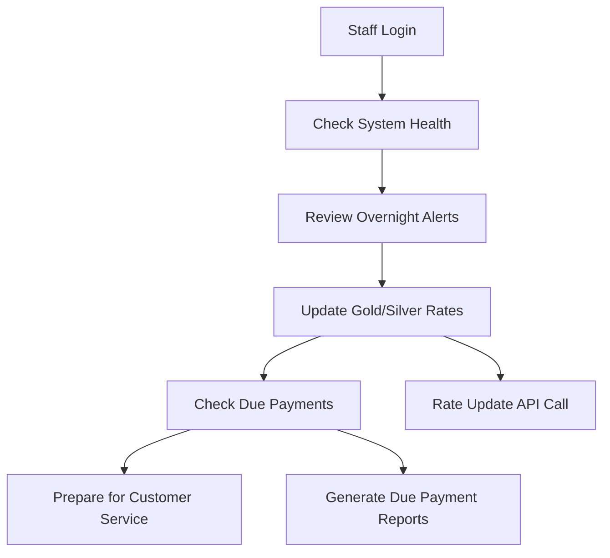
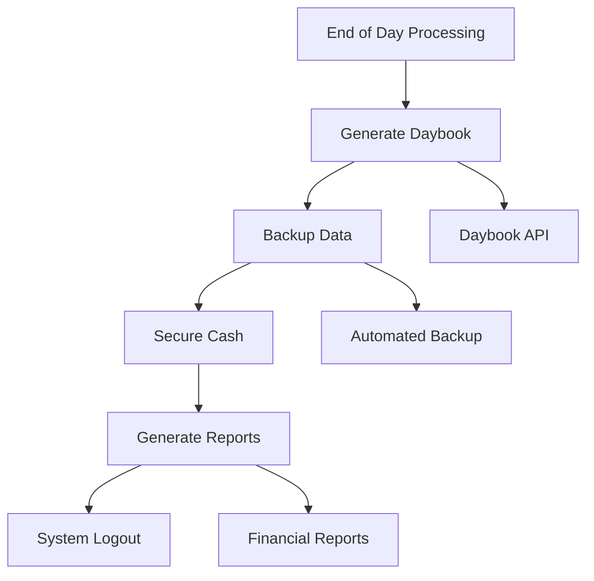
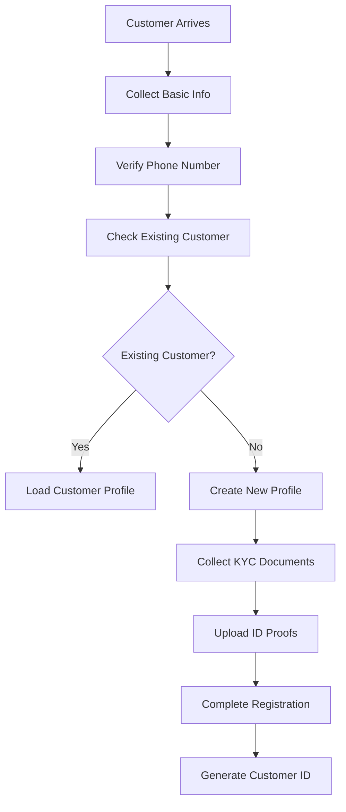
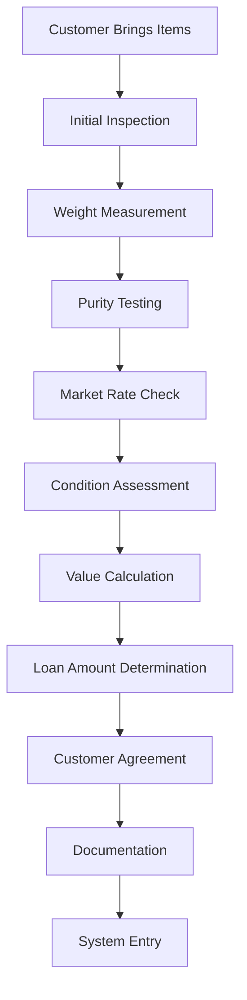
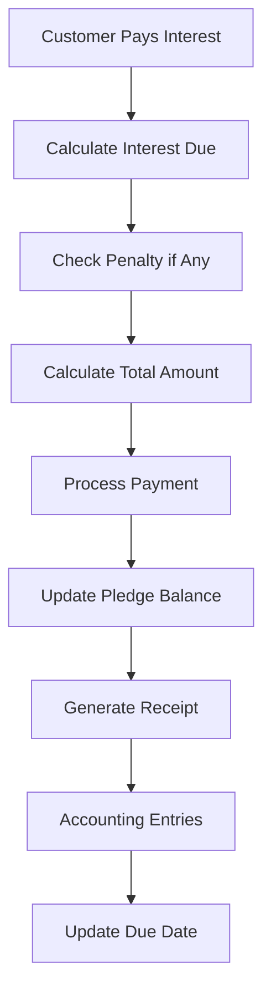
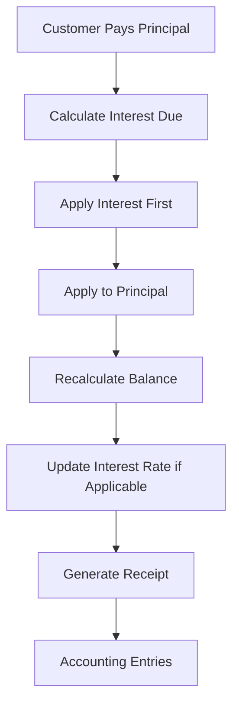
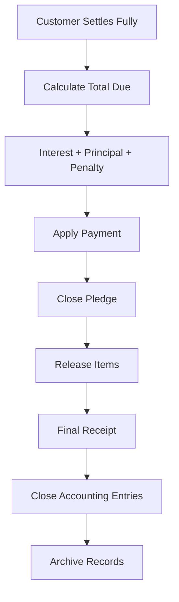
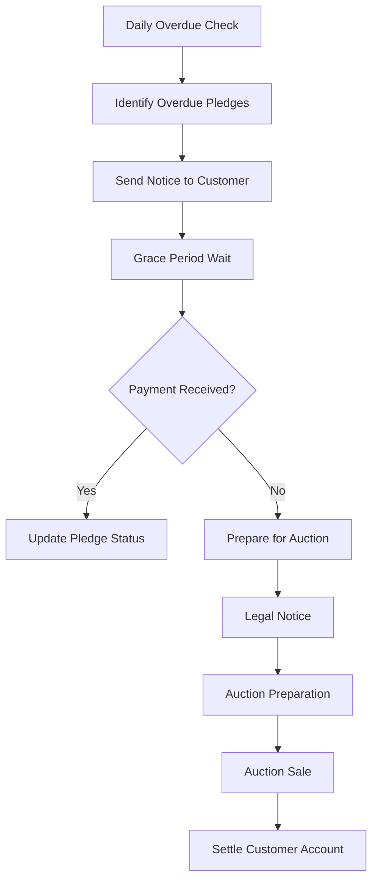
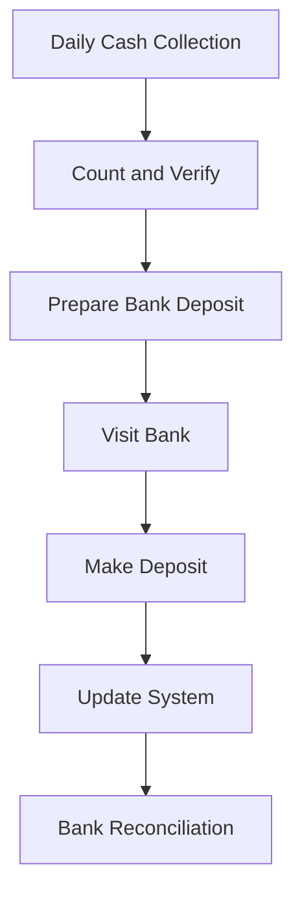

# 💼 Business Workflows Guide

Complete pawn shop business processes and their implementation in PawnSoft

## 📋 Overview

This guide explains how traditional pawn shop operations are digitized and automated in PawnSoft, covering:
- Daily business operations
- Customer management
- Pledge lifecycle
- Payment processing
- Accounting integration
- Regulatory compliance

---

## 🏪 Daily Operations Workflow

### Opening Procedures


**Implementation in PawnSoft:**

1. **Staff Login**
   ```http
   POST /token
   {
     "username": "staff_member",
     "password": "secure_password"
   }
   ```

2. **Update Daily Rates**
   ```http
   POST /gold_silver_rates
   {
     "date": "2025-01-15",
     "jewell_type_id": 1,
     "rate": 6500.00
   }
   ```

3. **Check Due Payments**
   ```http
   GET /pledges?status=active&due_date_before=2025-01-15
   ```

### Closing Procedures


**Implementation:**
```http
GET /api/v1/daybook/daily_summary?company_id=1&date=2025-01-15
GET /api/v1/daybook/export?company_id=1&from_date=2025-01-15&to_date=2025-01-15&format=csv
```

---

## 👤 Customer Management Workflow

### New Customer Registration



**API Implementation:**

1. **Check Existing Customer**
   ```http
   GET /customers/search?query=9876543210
   ```

2. **Create New Customer**
   ```http
   POST /customers
   {
     "customer_name": "Rajesh Kumar",
     "father_husband_name": "Suresh Kumar",
     "phone_number": "+91-9876543210",
     "address": "123 Main Street, City",
     "id_proof_type": "Aadhaar",
     "id_proof_number": "1234-5678-9012",
     "company_id": 1,
     "area_id": 1
   }
   ```

3. **Upload KYC Documents**
   ```http
   POST /upload_file
   Content-Type: multipart/form-data
   
   file: <id_proof_image>
   company_id: 1
   upload_type: "customer_id_proof"
   ```

### Customer Verification Process

**Business Rules:**
- Phone number must be unique within company
- ID proof mandatory for loans above ₹10,000
- Photo required for all customers
- Address verification for high-value pledges

**Data Validation:**
```python
class CustomerValidation:
    @staticmethod
    def validate_phone(phone: str) -> bool:
        # Indian mobile number validation
        pattern = r'^(\+91|0)?[6-9]\d{9}$'
        return bool(re.match(pattern, phone))
    
    @staticmethod
    def validate_aadhaar(aadhaar: str) -> bool:
        # Aadhaar number validation
        pattern = r'^\d{4}-\d{4}-\d{4}$'
        return bool(re.match(pattern, aadhaar))
```

---

## 💎 Pledge Creation Workflow

### Item Appraisal Process



**Valuation Formula:**
```
Item Value = Weight × Purity × Current Rate × Condition Factor
Max Loan Amount = Item Value × Scheme LTV Ratio
```

**API Implementation:**

1. **Get Current Rates**
   ```http
   GET /gold_silver_rates?jewell_type_id=1&date=2025-01-15
   ```

2. **Create Pledge with Items**
   ```http
   POST /pledges
   {
     "customer_id": 1,
     "company_id": 1,
     "scheme_id": 1,
     "pledge_amount": 50000.00,
     "interest_rate": 2.5,
     "months": 12,
     "pledge_date": "2025-01-15",
     "items": [
       {
         "item_name": "Gold Necklace",
         "metal_type": "Gold",
         "weight": 25.5,
         "purity": "22K",
         "item_value": 60000.00,
         "description": "Traditional gold necklace with intricate work"
       }
     ]
   }
   ```

### Pledge Documentation

**Automated System Entries:**

1. **Accounting Entries (Double Entry)**
   ```
   Dr. Pledged Ornaments (Asset)     ₹60,000
       Cr. Customer Account (Liability)    ₹50,000
       Cr. Margin/Buffer (Equity)          ₹10,000
   ```

2. **Voucher Entry**
   ```http
   POST /api/v1/vouchers
   {
     "voucher_type": "Pledge Creation",
     "total_amount": 50000.00,
     "reference_table": "pledges",
     "reference_id": 1,
     "narration": "Pledge created for customer Rajesh Kumar"
   }
   ```

### Business Rules for Pledges

```python
class PledgeBusinessRules:
    @staticmethod
    def calculate_loan_amount(item_value: float, scheme_ltv: float) -> float:
        """Calculate maximum loan amount based on item value and scheme LTV"""
        return item_value * (scheme_ltv / 100)
    
    @staticmethod
    def calculate_due_date(pledge_date: date, months: int) -> date:
        """Calculate due date based on pledge date and term"""
        return pledge_date + relativedelta(months=months)
    
    @staticmethod
    def validate_pledge_amount(item_value: float, pledge_amount: float, 
                             max_ltv: float) -> bool:
        """Validate pledge amount doesn't exceed maximum LTV"""
        max_allowed = item_value * (max_ltv / 100)
        return pledge_amount <= max_allowed
```

---

## 💰 Payment Processing Workflow

### Interest Payment



**Interest Calculation:**
```python
def calculate_monthly_interest(pledge_amount: float, rate: float, 
                             days: int = 30) -> float:
    """Calculate monthly interest"""
    daily_rate = rate / 100 / 30  # Convert monthly rate to daily
    return pledge_amount * daily_rate * days

def calculate_penalty(overdue_days: int, pledge_amount: float, 
                     penalty_rate: float) -> float:
    """Calculate penalty for overdue payments"""
    if overdue_days <= 0:
        return 0.0
    daily_penalty = penalty_rate / 100 / 30
    return pledge_amount * daily_penalty * overdue_days
```

**API Implementation:**
```http
POST /pledge_payments
{
  "pledge_id": 1,
  "payment_date": "2025-02-15",
  "payment_type": "interest",
  "amount": 1250.00,
  "interest_amount": 1250.00,
  "principal_amount": 0.00,
  "penalty_amount": 0.00,
  "payment_method": "cash",
  "receipt_no": "REC001"
}
```

### Principal Payment

**Partial Principal Payment:**


**Full Settlement:**


### Accounting Integration for Payments

**Interest Payment Entries:**
```
Dr. Cash in Hand                    ₹1,250
    Cr. Interest Income                 ₹1,250
```

**Principal Payment Entries:**
```
Dr. Cash in Hand                    ₹10,000
    Cr. Customer Account (Liability)    ₹10,000
```

**API Implementation:**
```http
POST /api/v1/ledger/auto-entries
{
  "transaction_type": "payment",
  "reference_table": "pledge_payments",
  "reference_id": 1,
  "amount": 1250.00,
  "payment_type": "interest"
}
```

---

## 🏛️ Auction Process Workflow

### Overdue Pledge Management



**Overdue Identification:**
```python
def identify_overdue_pledges():
    """Identify pledges overdue by more than grace period"""
    grace_period = 30  # days
    cutoff_date = date.today() - timedelta(days=grace_period)
    
    overdue_pledges = db.query(Pledge).filter(
        Pledge.due_date < cutoff_date,
        Pledge.status == 'active'
    ).all()
    
    return overdue_pledges
```

### Auction Sale Process

**Pre-Auction:**
1. Legal notice to customer
2. Item photography and cataloging
3. Market valuation update
4. Auction advertisement

**During Auction:**
1. Item display and inspection
2. Bidding process
3. Sale completion
4. Payment collection

**Post-Auction:**
1. Customer account settlement
2. Profit/loss calculation
3. Accounting entries
4. Compliance reporting

**API Implementation:**
```http
POST /auction_sales
{
  "pledge_id": 1,
  "sale_date": "2025-03-15",
  "sale_amount": 55000.00,
  "buyer_details": "Auction House ABC",
  "auction_charges": 2000.00,
  "net_proceeds": 53000.00
}
```

**Auction Accounting:**
```
Dr. Cash in Hand                    ₹53,000
Dr. Auction Expenses               ₹2,000
    Cr. Pledged Ornaments              ₹50,000
    Cr. Customer Account               ₹2,000  (excess to customer)
    Cr. Auction Income                 ₹3,000  (profit)
```

---

## 📊 Reporting Workflows

### Daily Reports

**Morning Reports:**
1. Cash position
2. Due payments today
3. New pledges from yesterday
4. Interest collections

**Evening Reports:**
1. Day's transactions summary
2. Cash reconciliation
3. Pending follow-ups
4. System backup status

**API Implementation:**
```http
GET /api/v1/daybook/daily_summary?company_id=1&date=2025-01-15
GET /reports/cash_position?company_id=1&date=2025-01-15
GET /reports/due_payments?company_id=1&date=2025-01-15
```

### Monthly Reports

**Financial Reports:**
1. Profit & Loss Statement
2. Balance Sheet
3. Cash Flow Statement
4. Customer aging report

**Business Reports:**
1. Interest income analysis
2. Pledge portfolio status
3. Customer acquisition
4. Auction performance

**Regulatory Reports:**
1. RBI compliance report
2. Income tax documentation
3. Audit trail reports
4. Customer transaction reports

---

## 🔄 System Integration Workflows

### Banking Integration

**Bank Deposit Process:**


**API Implementation:**
```http
POST /bank_transactions
{
  "bank_id": 1,
  "transaction_type": "deposit",
  "amount": 150000.00,
  "transaction_date": "2025-01-15",
  "reference_number": "DEP123456",
  "description": "Daily cash deposit"
}
```

### Third-Party Integrations

**SMS Integration for Notifications:**
```python
def send_payment_reminder(customer_phone: str, amount: float, due_date: date):
    """Send SMS reminder for due payments"""
    message = f"Dear Customer, your payment of ₹{amount} is due on {due_date}. Please visit our office. - PawnSoft"
    # SMS API integration
    send_sms(customer_phone, message)
```

**Email Integration for Reports:**
```python
def email_daily_report(report_data: dict, recipients: list):
    """Email daily business report to management"""
    # Email API integration
    send_email(
        recipients=recipients,
        subject=f"Daily Business Report - {date.today()}",
        template="daily_report",
        data=report_data
    )
```

---

## 📋 Compliance Workflows

### RBI Compliance

**Monthly Reporting:**
1. Customer transaction reports
2. High-value transaction alerts
3. Suspicious activity reports
4. Regulatory compliance checklist

**KYC Compliance:**
1. Customer identity verification
2. Document collection and storage
3. Periodic KYC updates
4. Risk assessment

### Audit Trail

**System maintains complete audit trail for:**
- All financial transactions
- User access logs
- Data modifications
- System configuration changes

**API Implementation:**
```http
GET /audit_logs?from_date=2025-01-01&to_date=2025-01-31&user_id=1
GET /compliance_reports/kyc_status?company_id=1
GET /compliance_reports/high_value_transactions?amount_threshold=100000
```

---

## 🚨 Exception Handling Workflows

### System Downtime

**Procedure:**
1. Switch to manual operations
2. Document all transactions
3. System recovery
4. Data entry backlog processing
5. Reconciliation

### Data Recovery

**Backup Strategy:**
1. Real-time transaction logging
2. Daily full database backup
3. Weekly system backup
4. Monthly archive

**Recovery Process:**
1. Assess data loss extent
2. Restore from latest backup
3. Re-enter missing transactions
4. Verify data integrity
5. Resume operations

---

## 📞 Customer Service Workflows

### Customer Inquiries

**Common Inquiries:**
- Account balance
- Payment due dates
- Interest calculations
- Item status
- Settlement amounts

**Self-Service Options:**
- SMS balance inquiry
- Online payment portal
- Mobile app access
- WhatsApp integration

### Complaint Resolution

**Process:**
1. Record complaint
2. Investigate issue
3. Propose resolution
4. Customer approval
5. Implementation
6. Follow-up

**System Support:**
```http
POST /customer_complaints
{
  "customer_id": 1,
  "complaint_type": "billing_dispute",
  "description": "Disagree with interest calculation",
  "priority": "medium",
  "assigned_to": 2
}
```

---

**Business Process Owner**: Operations Manager
**Last Updated**: January 15, 2025
**Process Version**: 1.0.0